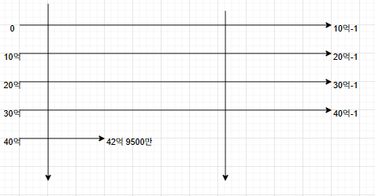

메이플스토리 오리지널에서 드랍률 코딩이 편의상 C언어의 unsigned int를 통해 이루어졌다고 하고,  
그 범위는 0부터 42억 9500만 까지라고 하자.  
실제로 32비트 시스템에서 unsigned int의 범위는 0 ~ 4,294,967,295 (2³² - 1) 이다.  
그러나 개발자들은 이 범위 안에서 균등하게 난수가 생성되는 함수를 0부터 무한대까지 균등하게 생성되는 함수로 오해했던 것으로 보인다.

이제 이를 % (10억) 연산하여 보자. 

**모듈러 연산 후 숫자들의 등장 횟수 표**
|0 - 2억 9500만|2억 9500만 - (10억-1)|
|:---:|:---:|
|5회|4회|

개발자들의 오해 안에선 저 가로선들이 끝없이 생긴다. 따라서 끝부분의 연산은 고려되지 않는다.

다만, 실제로는 42억 9500만까지 10억 선이 4개 생기고 남은 하나가 짧은 선이 나온다.

따라서 앞부분의 2억 9500만까지의 수들이 등장하는 빈도의 평균은 뒷부분에 비해 25% 더 높으며, 뒷부분은 앞부분에 비해 20% 드물게 나온다.

이를 개선하기 위해선 최신 랜덤 라이브러리를 통핸 랜덤 구현, 모튤러 연산을 피하는 랜덤 구현, 10억을 1000으로 낮추는 등의 편향 최소화. 40억 이상의 수가 나오면 다시뽑기를 진행하기 등의 방법이 있다.
