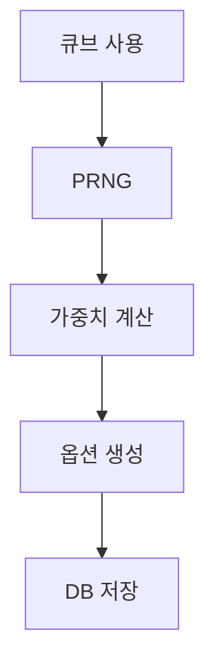
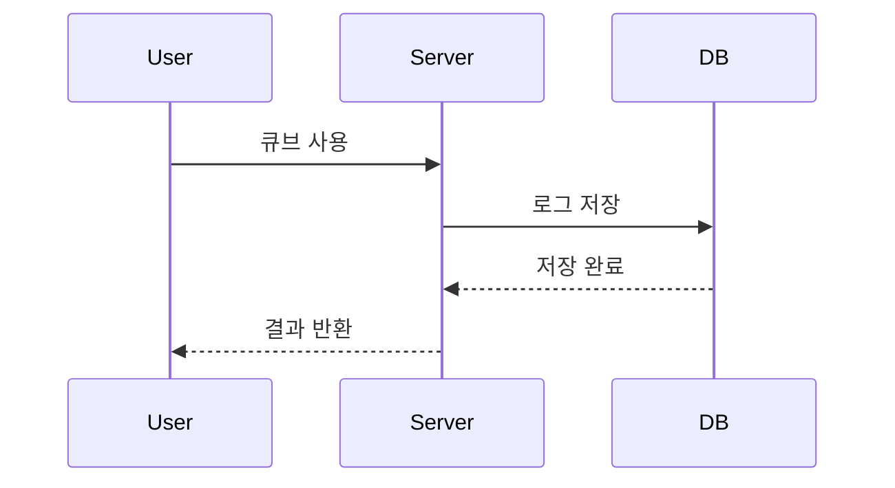
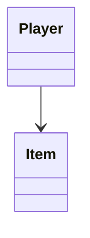

> [!NOTE]
> 본 문서의 '사건 개요'는 공개된 공식 자료를 요약한 것입니다.
>
> 이후의 컴퓨터과학적 설명과 알고리즘 예시는 작성자의 학습 및 교육 목적의 해석이며, 실제 서비스의 내부 구현을 의미하지 않습니다.

> [!WARNING]
> 아래 알고리즘은 실제 메이플스토리의 내부 구현이 아니라 교육을 위한 예시입니다.

> [!IMPORTANT]
> 사건의 법적 판단은 공식 발표 및 재판 결과를 기준으로 합니다.

- [x] 사건 요약
- [x] 알고리즘 분석
- [ ] 자료구조 분석
- [ ] 개선안 작성

## 목차

- [사건 개요](#사건-개요)
- [알고리즘](#알고리즘)
- [자료구조](#자료구조)
- [개선안](#개선안)

